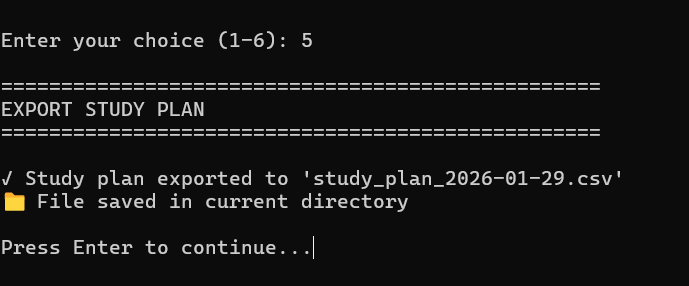

# 📚 Smart Timetable App

A simple yet powerful timetable application that helps you plan your study schedule for exams.

## ✨ Features

1. **Add Exams** - Add your exams with subject, date, and study hours
2. **Countdown Timer** - See days remaining for each exam
3. **Daily Study Suggestion** - Get personalized study tasks for today
4. **Progress Tracking** - Track completion percentage for each subject
5. **Export to CSV** - Export your study plan for offline use

## 📸 Screenshots

### 1. Main Menu


### 2. Adding an Exam


### 3. Countdown Timer  


### 4. Progress Tracking


### 5. CSV Export



## 🚀 Getting Started

### Prerequisites
- Python 3.6 or higher

### Installation
```bash
# Clone the repository
git clone https://github.com/yourusername/smart-timetable-app.git

# Navigate to the project directory
cd smart-timetable-app

# No installation required! Python has all built-in modules
